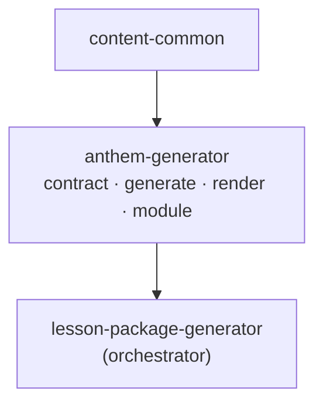

# Anthem Generator: Architecture and Philosophy (찬양)

> 찬양 독립 모듈의 설계 철학과 아키텍처. `lesson-package-generator`의 Step 3 로직을 추출한 자식 모듈.
> 추출 전체 맥락: 저장소 루트 `MODULE-EXTRACTION-PLAN.md`.

---

## 1. 설계 철학

### 1.1 찬양은 메시지를 노래로 기억하게 한다
찬양은 본문을 새로 해석하지 않는다. 수업안/교보재의 **핵심메시지를 노래라는 형식으로 각인**시킨다. 정합 입력(수업안·교보재)이 없으면 본문·테마·대상만으로 동작하되, 동일한 변환 책임만 진다.

### 1.2 만들지 않는 것을 분명히 한다
음원은 직접 생성하지 않는다(`delivery: external`). 대신 **Suno로 넘길 단일 통합 프롬프트**와 오리지널 가사를 산출한다. 이는 P3(리소스 정확성)의 적용 — 정확한 핸드오프 산출물을 제공하되 외부 생성은 외부 도구에 위임.

---

## 2. 모듈 경계와 의존



- 상위(lesson-package)·형제(material/promo)를 **import하지 않는다**.
- `content-common`만 공유.
- lesson-package는 `scripts/modules/step3_praise.py` + `scripts/praise_contract.py` shim → `anthem_generator` 재사용.

---

## 3. 디커플링 (추출의 핵심)

추출 전 찬양은 교보재 산출물을 `lesson-package/outputs/teaching` **하드코딩 경로로 직접 읽었다**(`resolve_teaching`의 기본 경로). 추출하며 이를 제거했다:

| 항목 | 변경 |
|------|------|
| 교보재 컨텍스트 | `teaching_downstream` **dict 주입**(호출자 제공) 또는 명시 `teaching_dir`만 |
| 기본 경로 | `project_root_from_script()/outputs/teaching` 제거 |
| 결과 | anthem은 material을 **코드로도 경로로도** 의존하지 않음(데이터 계약만) |

---

## 4. 데이터 플로우 / 계약

```
intake(body_text, theme, audience)  (+ optional lesson_plan, teaching_downstream)
  → generate_anthem_package → praise-worship.v1
       ├─ inputs.key_message   (lesson_plan.key_message > 교보재 key_message > 기본)
       ├─ song.lyrics{verse1, chorus, verse2, bridge}  (오리지널)
       ├─ music_generation.prompt_combined  (Suno)
  → render → lyrics/full_lyrics.md · music/suno_prompt.txt · leader_notes.md
  → build_downstream_payload → {suno_prompt, song_title, key_message, chorus_preview}
```

- **하위 소비**: 홍보영상(promo) 모듈이 downstream을 **데이터로** 받는다.
- **계약 안정성**: `FORMAT_VERSION = "praise-worship.v1"` 고정 — 추출 후에도 변경 금지.

---

## 5. 품질 보장

| 계층 | 메커니즘 |
|------|----------|
| 생성 | Claude(API) 또는 결정론적 placeholder |
| 파싱 | `_strip_json_fence` + JSON 파싱, 실패 시 폴백 |
| 검증(P1) | `validate_anthem_package`: 가사 4부 + `prompt_combined`·bpm |
| 폴백 | 파싱/검증 실패 시 placeholder로 안전 강하 |

---

## 6. 주요 설계 결정 (ADR)

- **ADR-A1: 독립 패키지 이름 `anthem_generator`** — 형제 모듈 간 이름 충돌 방지(고유 import 이름).
- **ADR-A2: 계약 버전 유지(`praise-worship.v1`)** — 하위(홍보) 호환을 위해 불변.
- **ADR-A3: 교보재 경로 의존 제거 → 데이터 주입** — 단독 실행 가능 + 모듈 간 코드/경로 결합 0.
- **ADR-A4: 음원 비생성(external)** — Suno 핸드오프 프롬프트만 산출(렌더링은 비목표).

---

*문서 버전: 1.0 — module-extraction Phase 2~4 반영.*
