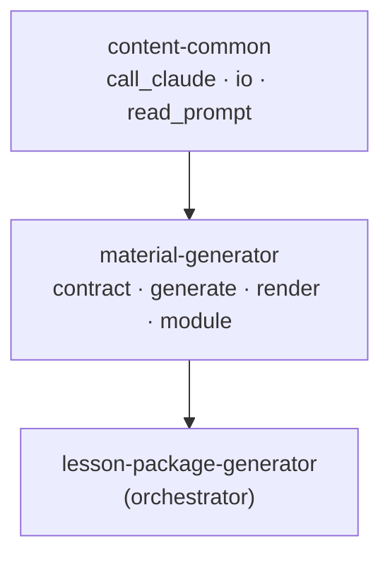

# Material Generator: Architecture and Philosophy (교보재)

> 교보재 독립 모듈의 설계 철학과 아키텍처. `lesson-package-generator`의 Step 2 로직을 추출한 자식 모듈.
> 추출 전체 맥락: 저장소 루트 `MODULE-EXTRACTION-PLAN.md`.

---

## 1. 설계 철학

### 1.1 교보재는 수업안에서 파생된다
교보재는 본문을 **독립적으로 재해석하지 않는다**. 가능하면 승인된 수업안의 핵심메시지를 입력으로 받아 그것을 게임·토의·활동·워크시트라는 **매체로 변환**한다. 수업안이 없으면 본문·테마·대상만으로 동작하되(단독 실행), 동일한 변환 책임만 진다.

### 1.2 품질 절대주의의 적용
- placeholder 모드조차 `"[자리표시자]"`가 아니라 4종 컴포넌트가 채워진 실제 교보재를 산출(구조 데모 보장).
- 출력은 고정 계약(`teaching-materials.v1`)을 만족해야 하며, 위반 시 결정론적 폴백.

---

## 2. 모듈 경계와 의존



- **상위를 모른다**: lesson-package를 import하지 않는다.
- **형제를 모른다**: anthem/promo 모듈을 import하지 않는다.
- **공유는 하나**: `content-common`만 의존(중복 제거).
- lesson-package는 `scripts/modules/step2_teaching.py` shim → `material_generator.run` 으로 재사용.

---

## 3. 데이터 플로우 / 계약

```
intake(body_text, theme, audience [, volume])  (+ optional lesson_plan)
  → generate_material_package → teaching-materials.v1
       ├─ summary.key_message            (lesson_plan.key_message 우선 정합)
       ├─ components.{intro_game,discussion,activity,worksheet}
       ├─ slides[]  (image_slot: [IMG: …])
  → render → worksheet.html/pdf · slides.html · components/*.md
  → build_downstream_payload → {key_message, discussion_questions, image_prompts}
```

- **하위 소비**: 찬양(anthem)·홍보(promo) 모듈이 downstream을 **데이터로** 받는다(코드 의존 없음).
- **계약 안정성**: `FORMAT_VERSION = "teaching-materials.v1"` 고정 — 추출 후에도 변경 금지(하위 호환).

---

## 4. 품질 보장

| 계층 | 메커니즘 |
|------|----------|
| 생성 | Claude(API) 또는 결정론적 placeholder |
| 파싱 | `_strip_json_fence` + JSON 파싱, 실패 시 폴백 |
| 검증(P1) | `validate_material_package`: 4종 컴포넌트·슬라이드(≥1)·`intake.body_text` |
| 폴백 | 파싱/검증 실패 시 placeholder로 안전 강하 |

---

## 5. 외부 AI 핸드오프
교보재는 삽화를 직접 렌더링하지 않는다. `[IMG: 설명]` 슬롯을 산출하고, 이를 모은 `image_prompts`를 이미지 생성 AI로 넘긴다(P3 리소스 정확성).

---

## 6. 주요 설계 결정 (ADR)

- **ADR-M1: 독립 패키지 이름 `material_generator`** — lesson-package가 import하려면 `scripts`가 아닌 고유 패키지명이 필요(형제 모듈 간 이름 충돌 방지).
- **ADR-M2: 계약 버전 문자열 유지(`teaching-materials.v1`)** — 추출은 코드 위치 이동일 뿐, 하위 모듈 호환을 위해 계약은 불변.
- **ADR-M3: 공통 인프라는 `content-common` 공유** — 인프라 중복 0. 모듈은 도메인 로직만 보유.
- **ADR-M4: shim 호환 레이어 유지** — lesson-package는 안정적 `step2_teaching` 이름으로 호출, 내부 재배치와 분리.

---

*문서 버전: 1.0 — module-extraction Phase 1~4 반영.*
