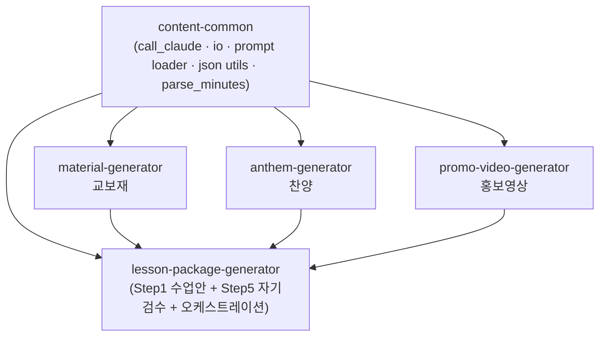

# Module Extraction Plan — 교보재·찬양·홍보영상 독립 워크플로우화

> **상태**: PLAN (코드 작성 전 — 승인 후 구현)
> **목적**: `lesson-package-generator` 안에 종속된 교보재·찬양·홍보영상 단계 로직을 각각 **독립 워크플로우 모듈**로 추출한다.
> **불변 원칙**: 로직 중복 금지 · 기존 `lesson-package-generator` 무중단 · `autobiography-generator`와 동일 구조.

---

## 0. 한눈에 보기

| 추출 대상(현재) | 신규 모듈(독립) | 도메인 | 단독 입력 |
|----------------|----------------|--------|----------|
| `step2_teaching` + `teaching_*` | **`material-generator`** | 교보재 | 본문·테마·대상 (+lesson_plan 선택) |
| `step3_praise` + `praise_*` | **`anthem-generator`** | 찬양 | 본문·테마·대상 (+lesson_plan, +교보재 선택) |
| `step4_promo` + `promo_*` | **`promo-video-generator`** | 홍보영상 | 테마·대상 (+lesson_plan, +교보재/찬양 선택) |

`lesson-package-generator`는 이 세 모듈을 **import 해서 호출**한다(복제 아님). 각 모듈은 `lesson-package` 없이도 단독 실행된다.

---

## 1. 목표와 비목표

### 목표
1. 세 모듈을 `autobiography-generator`와 **동일한 서브프로젝트 구조**(폴더 + 문서 3종 + AGENTS/CLAUDE 등록)로 만든다.
2. 각 모듈 **단독 실행** 가능 — 입력은 본문·테마·대상, `lesson_plan`은 선택, 상위 산출물(교보재→찬양→홍보)도 선택.
3. **로직 중복 0** — 공통 인프라는 공유 패키지로, 도메인 로직은 각 모듈에 유일하게 존재. `lesson-package`는 재사용만.
4. 추출 중·후 **기존 `lesson-package-generator`가 항상 동작**(테스트·오케스트레이터·웹앱).

### 비목표 (이번 범위 아님)
- 콘텐츠 품질 개선(BUG-2 등)·새 기능 추가.
- 웹앱 분리(별도 결정). 단, 기존 통합 웹앱이 깨지지 않게만 보장.
- 음원/영상 렌더링 추가.

---

## 2. 현재 결합 구조 분석 (추출 전 사실관계)

`lesson-package-generator/scripts/` 안의 결합을 분류한다.

### 2.1 공통 인프라 (도메인 무관, 모두가 사용)
| 파일 | 역할 | 사용처 |
|------|------|--------|
| `claude_client.py` | `call_claude`, `_use_placeholder` | 전 모듈 |
| `io_helpers.py` | `write_json/write_text/read_prompt/project_root_from_script/ensure_output_dirs` | 전 모듈 |
| `modules/_common.py` | `run_step`, `prompts_dir` | step1·step5 (부가물은 미사용) |
| `pipeline_options.py`, `sot_lib.py` | 오케스트레이션 옵션·SOT | 오케스트레이터 |

> **주의(부수 결합)**: `claude_client._placeholder_step2/3/4_json`이 `teaching/praise/promo_contract`를 import한다. 그러나 `generate_*`가 placeholder 모드에서 `call_claude` 이전에 단락(short-circuit)되므로 **이 헬퍼들은 사실상 죽은 코드**다 → 추출 시 제거하여 공통 인프라를 도메인-무관으로 유지한다.

### 2.2 도메인 로직 (모듈별 유일 — 추출 대상)
| 도메인 | 파일 |
|--------|------|
| 교보재 | `teaching_contract.py`, `teaching_generate.py`, `teaching_render.py`, `modules/step2_teaching.py`, `run_teaching_materials.py`, `schemas/teaching_materials.v1.schema.json`, `agents/prompts/step2_teaching_materials.md`, `tests/test_teaching_materials.py` |
| 찬양 | `praise_contract.py`, `praise_generate.py`, `praise_render.py`, `modules/step3_praise.py`, `run_praise_worship.py`, `schemas/praise_worship.v1.schema.json`, `agents/prompts/step3_praise_worship.md`, `tests/test_praise_worship.py` |
| 홍보영상 | `promo_contract.py`, `promo_generate.py`, `promo_render.py`, `assemble_promo_video.py`, `modules/step4_promo.py`, `run_promo_video.py`, `schemas/promo_video.v1.schema.json`, `agents/prompts/step4_promo_video.md`, `tests/test_promo_video.py` |

### 2.3 모듈 간 데이터 의존 (중요)
- **찬양 ← 교보재**: `praise_generate.resolve_teaching/load_teaching_downstream`가 교보재 `downstream` JSON을 읽는다.
- **홍보 ← 교보재·찬양**: `promo_generate`가 두 downstream을 읽는다.
- 결합 형태는 대부분 **데이터(downstream dict/파일)** 이지 코드 import가 아니다 → 추출 후 **호출자(lesson-package 또는 사용자)가 downstream dict를 주입**하는 방식으로 정리하면 모듈 간 코드 의존이 사라진다.

### 2.4 코어/통합 (lesson-package에 잔류)
`lesson_plan_*`(Step1 core), `package_check.py`/`validate_package_integrity.py`(Step5), `orchestrator.py`, `modules/step1_lesson_plan.py`, `modules/step5_self_check.py`, `webapp/`.

---

## 3. 목표 아키텍처

### 3.1 의존성 DAG (순환 없음)



- **누구도 `lesson-package`를 import하지 않는다** (모듈은 상위를 모른다).
- **모듈끼리도 import하지 않는다** — 교보재→찬양→홍보 연계는 **downstream dict를 호출자가 전달**(데이터 계약). 단독 실행 시 그냥 생략.
- 공통 인프라는 `content-common` 하나로 모은다(중복 제거의 핵심).

### 3.2 신규 공유 패키지 `content-common`
`claude_client` + `io_helpers` + 프롬프트 로더 + `_strip_json_fence` + `parse_minutes`를 도메인-무관 형태로 이전. 모든 모듈과 lesson-package가 여기서 import.
> 대안(부록 결정 D-1): 공유 패키지 없이 각 모듈이 ~60줄 제너릭 헬퍼를 자체 보유(vendoring). 도메인 로직 중복은 아니지만 인프라 중복이 생김 → 본 PLAN은 **공유 패키지**를 기본안으로 권장.

---

## 4. 각 모듈 표준 구조 (autobiography-generator 미러링)

```
material-generator/                 (anthem-generator/, promo-video-generator/ 동일)
├── PLAN.md                         모듈 마스터 플랜 (vN)
├── workflow.md                     ★ 독립 워크플로우 정의 (R→P→I)
├── state.yaml                      SOT (경량)
├── scripts/
│   ├── orchestrator.py             단독 실행 진입점 (intake → generate → validate → render)
│   ├── {x}_contract.py / {x}_generate.py / {x}_render.py
│   └── validate_{x}.py             P1 게이트
├── schemas/{x}.v1.schema.json
├── agents/prompts/{x}.md           단계 프롬프트 (이 모듈이 유일 소유)
├── tests/test_{x}.py
└── outputs/
```

루트 문서 3종 (접두사):
| 모듈 | 문서 3종 |
|------|---------|
| material-generator | `MATERIAL-README.md` · `MATERIAL-USER-MANUAL.md` · `MATERIAL-ARCHITECTURE-AND-PHILOSOPHY.md` |
| anthem-generator | `ANTHEM-README.md` · `ANTHEM-USER-MANUAL.md` · `ANTHEM-ARCHITECTURE-AND-PHILOSOPHY.md` |
| promo-video-generator | `PROMO-VIDEO-README.md` · `PROMO-VIDEO-USER-MANUAL.md` · `PROMO-VIDEO-ARCHITECTURE-AND-PHILOSOPHY.md` |

---

## 5. 단독 실행 사양 (모듈 공통)

```
intake = { body_text(본문), theme(테마), audience(대상) }   # 필수
optional = { lesson_plan, upstream_downstream{teaching|praise} }  # 선택
```
- **CLI**: `python material-generator/scripts/orchestrator.py --body "..." --theme "..." --audience "중등부"`
- **함수 API**: `from material_generator import generate_material_package(intake, lesson_plan=None)` → 검증된 `teaching-materials.v1` dict.
- `lesson_plan`/upstream이 없으면 intake만으로 생성(기존 `_minimal_lesson_plan` 폴백 로직 계승). 있으면 정합 강화.

---

## 6. 재사용 전략 — "중복 금지"의 구체화

1. **도메인 로직은 신규 모듈에만 존재**. `lesson-package`는 더 이상 `teaching_*`/`praise_*`/`promo_*`를 보유하지 않는다.
2. **lesson-package 오케스트레이터는 import로 호출**:
   ```python
   from material_generator import generate_material_package
   from anthem_generator import generate_anthem_package
   from promo_video_generator import generate_promo_package
   ```
   Step2/3/4는 이 함수를 호출하고, downstream dict를 다음 모듈에 주입(현재 체이닝 동일 의미, 코드 위치만 이동).
3. **모듈 간 연계는 데이터 계약**(`teaching-materials.v1` downstream 등)으로. 모듈은 서로 import하지 않는다.
4. **공통 인프라는 `content-common` 단일 소스**.

### 6.1 import / 패키징 방식 (결정 D-2)
- **기본안 (경량, 비개발자 친화)**: `sys.path` 부트스트랩. lesson-package `orchestrator.py`가 이미 `sys.path.insert(0, PROJECT_ROOT)`를 쓰듯, 각 진입점이 형제 폴더(`../content-common`, `../material-generator` 등)를 path에 추가하는 한 줄 규약(`_bootstrap.py`)을 둔다. 패키징 파일 불필요.
- **대안 (정석)**: 각 폴더에 `pyproject.toml` + `pip install -e`. 더 견고하나 환경 설정 부담. → 후속 업그레이드로 분리.

### 6.2 프롬프트 경로
`prompts_dir()`는 모듈 루트 기준으로 해석되어야 한다. `content-common`에 `prompts_dir(module_root)` 헬퍼를 두고 각 모듈이 자기 루트를 넘긴다(현재 `project_root_from_script` 의존 제거).

---

## 7. 기존 `lesson-package-generator`를 안 깨뜨리는 전략 ★

핵심 위험: import 경로 변경(`scripts.teaching_*` → `material_generator.*`)으로 오케스트레이터·테스트·웹앱이 깨질 수 있음.

### 7.1 무중단 원칙
- **한 번에 한 모듈씩** 추출하고, 각 단계 끝에 **전체 테스트 + 오케스트레이터 placeholder 실행**으로 그린 상태를 확인한 뒤 다음으로.
- 각 단계는 **독립 커밋**(롤백 단위).

### 7.2 호환 Shim (Strangler Fig 패턴)
추출 직후 기존 경로가 즉시 깨지지 않도록, lesson-package의 옛 파일을 **재노출(re-export) shim**으로 대체:
```python
# lesson-package-generator/scripts/teaching_generate.py  (shim, 임시)
from material_generator.teaching_generate import *   # noqa
```
- 오케스트레이터/테스트가 옛 경로를 쓰더라도 동작 → 그 다음 커밋에서 호출부를 신규 경로로 전환 → 마지막에 shim 삭제.
- 단계적 전환으로 "큰 빅뱅 이동" 없이 항상 동작.

### 7.3 테스트 이관
- `test_teaching_materials.py` 등은 신규 모듈로 이동(주 소유). lesson-package에는 **통합 테스트**(`test_pipeline.py`)만 남기되, import 경로를 신규 모듈로 갱신.
- 모든 테스트는 placeholder 모드(`LESSON_PACKAGE_PLACEHOLDER=1` 또는 모듈별 env)에서 통과해야 함.

### 7.4 웹앱
- 웹앱 JS는 Python을 import하지 않으므로 추출에 직접 영향 없음(독립).
- 단, 웹앱은 단계 프롬프트를 JS에 **복제 보유**한다(브라우저 한계). 이 복제는 추출 범위 밖의 알려진 seam → 위험 항목으로 추적(§10). 프롬프트 원본이 모듈로 이동하면, 추후 "프롬프트 단일 소스 → 빌드시 JS 주입" 과제를 별도로 둔다.

### 7.5 검증 게이트 (각 단계 후 필수)
```
1) pytest 전체 통과
2) python lesson-package-generator/scripts/orchestrator.py --with-teaching --with-praise --with-promo --auto-approve  → status=completed
3) validate_lesson_plan.py / validate_package_integrity.py → PASS
4) 각 신규 모듈 단독 실행(run/orchestrator) → 산출물 생성 + 모듈 P1 PASS
```

---

## 8. 단계별 실행 계획 (Phased)

| Phase | 내용 | 종료 조건(그린) |
|-------|------|----------------|
| **P0 — 공유 추출** | `content-common` 생성, `claude_client`/`io_helpers`/프롬프트로더/json·minutes 유틸 이전(죽은 placeholder 헬퍼 제거). lesson-package는 shim으로 옛 경로 유지 | 기존 테스트 전부 통과 |
| **P1 — material-generator** | 교보재 도메인 파일 이동 + 폴더 표준화 + orchestrator/validate + 단독 실행 + 테스트 이관. lesson-package는 import로 호출(또는 임시 shim) | §7.5 게이트 |
| **P2 — anthem-generator** | 찬양 이동. 교보재 의존을 **downstream dict 주입**으로 전환(코드 의존 제거) | §7.5 게이트 |
| **P3 — promo-video-generator** | 홍보영상 이동(+`assemble_promo_video.py`). 교보재·찬양 downstream 주입화 | §7.5 게이트 |
| **P4 — shim 제거 + 정리** | 옛 re-export shim 삭제, 호출부 신규 경로 확정, 죽은 코드 제거 | 전체 그린 + grep으로 옛 경로 0건 |
| **P5 — 문서·등록** | 모듈별 문서 3종(9개), `workflow.md` 3개, AGENTS §4/§6·CLAUDE 트리/스킬표 갱신, PLAN 동기화 | 링크·경로 검증 |

> 각 Phase는 독립 커밋. 문제가 생기면 직전 커밋으로 롤백.

---

## 9. 검증 체크리스트 (완료 기준)

- [ ] 각 모듈이 **lesson-package 없이** 단독 실행되어 검증 통과(`teaching-materials.v1` 등 + 모듈 P1).
- [ ] `lesson-package` 오케스트레이터가 세 모듈을 import 호출, 5단계 + 자기검수 PASS.
- [ ] **도메인 로직 중복 0** — `grep`으로 교보재/찬양/홍보 contract·generate·render가 각 1곳에만 존재.
- [ ] 공통 인프라가 `content-common` 1곳에만 존재.
- [ ] 모듈 간 **코드 import 0**(데이터 계약만).
- [ ] 웹앱 정상 동작(스모크).
- [ ] 세 모듈 구조가 autobiography-generator와 동형(폴더+문서3종+등록).

---

## 10. 위험과 완화

| 위험 | 영향 | 완화 |
|------|------|------|
| import 경로 변경으로 깨짐 | 오케스트레이터/테스트 실패 | Strangler shim(§7.2) + 단계별 게이트 |
| 형제 폴더 import 미해결 | 단독/통합 실행 실패 | `sys.path` 부트스트랩 규약(D-2), 후속 editable install |
| 모듈 간 데이터 계약 불일치 | 찬양/홍보가 교보재 downstream 못 읽음 | downstream 스키마 고정 + 통합 테스트 |
| 웹앱 프롬프트 복제본과 원본 분기 | 웹앱·CLI 결과 불일치 | seam으로 명시·추적, 후속 "프롬프트 단일 소스" 과제 |
| placeholder 모드 env 분산 | 모듈별 오프라인 동작 차이 | env 키 규약 통일(`CONTENT_PLACEHOLDER` 등, D-3) |
| git 파일 이동 이력 손실 | 추적성 저하 | `git mv` 사용 |

---

## 11. 등록·문서 변경 (Phase 5)

- **AGENTS.md**: §4 트리에 `content-common/`, `material-generator/`, `anthem-generator/`, `promo-video-generator/` + 각 `[*-하위 시스템 문서]` 추가. §6 카탈로그에 모듈 3종 항목(트리거·진입점·계약·P1·문서) 추가.
- **CLAUDE.md**: 트리 + 스킬 판별 테이블에 3종 추가(진입점: 각 `scripts/orchestrator.py`).
- **lesson-package PLAN.md**: §3·§11에 "부가물 로직은 외부 모듈로 추출, 본 시스템은 호출자" 명시.
- 트리거(안): 교보재 "교보재 만들어줘"/"teaching materials", 찬양 "찬양 만들어줘"/"워십송"/"praise", 홍보영상 "홍보영상 만들어줘"/"promo video".

---

## 12. 승인 전 확인할 결정 (Open Decisions)

| # | 결정 | 기본안(권장) |
|---|------|-------------|
| D-1 | 공통 인프라 분리 방식 | **공유 패키지 `content-common`** (vs 모듈별 vendoring) |
| D-2 | 형제 모듈 import 방식 | **`sys.path` 부트스트랩** (vs `pip install -e`) |
| D-3 | placeholder env 키 | 통일 키 `CONTENT_PLACEHOLDER`(기존 `LESSON_PACKAGE_PLACEHOLDER` 호환 유지) |
| D-4 | 모듈명 확정 | `material-generator` / `anthem-generator` / `promo-video-generator` |
| D-5 | 문서 3종 분량 | 모듈은 autobiography보다 경량(핵심 위주) 허용 여부 |
| D-6 | 웹앱 | 이번엔 통합 웹앱 유지(분리는 별도 과제) |

---

*문서 버전: 1.0 (PLAN, 코드 작성 전). 구현은 D-1~D-6 확정 후 Phase 0부터.*
