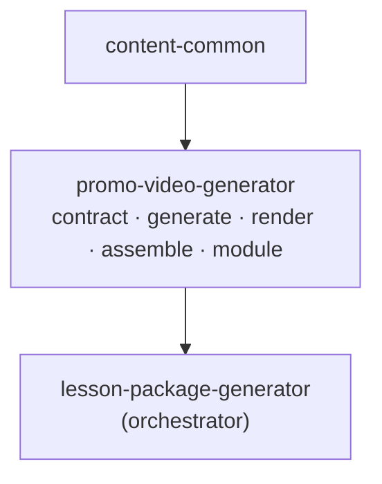

# Promo Video Generator: Architecture and Philosophy (홍보영상)

> 홍보영상 독립 모듈의 설계 철학과 아키텍처. `lesson-package-generator`의 Step 4 로직을 추출한 자식 모듈.
> 추출 전체 맥락: 저장소 루트 `MODULE-EXTRACTION-PLAN.md`.

---

## 1. 설계 철학

### 1.1 홍보영상은 메시지를 초대로 바꾼다
홍보영상은 본문을 해설하지 않는다. 수업안/교보재/찬양의 메시지를 30–45초의 **초대(invitation)**로 압축한다. 정합 입력이 없으면 테마·대상만으로 동작하되, 동일한 변환 책임만 진다.

### 1.2 렌더링하지 않고 기획·핸드오프한다
영상·음원을 직접 만들지 않는다. 컷별 **영상 생성 AI 프롬프트**(+이미지 폴백)와 **SRT 자막**, 그리고 (선택) ffmpeg **조립 스크립트**를 산출한다. 생성은 외부 도구에 위임(P3 리소스 정확성).

---

## 2. 모듈 경계와 의존



- 상위(lesson-package)·형제(material/anthem)를 **import하지 않는다**.
- `content-common`만 공유. ffmpeg 조립 로직(`assemble`)은 이 패키지에 포함.
- lesson-package는 `scripts/modules/step4_promo.py` + `scripts/promo_contract.py` + `scripts/assemble_promo_video.py` shim → `promo_video_generator` 재사용.

---

## 3. 디커플링 (추출의 핵심)

추출 전 홍보영상은 교보재·찬양 산출물을 `lesson-package/outputs/{teaching,praise}` **하드코딩 경로로 직접 읽었다**(`resolve_prior`의 기본 경로). 추출하며 제거했다:

| 항목 | 변경 |
|------|------|
| 교보재·찬양 컨텍스트 | `teaching_downstream`/`praise_downstream` **dict 주입** 또는 명시 dir만 |
| 기본 경로 | `project_root_from_script()/outputs/{teaching,praise}` 제거 |
| 결과 | promo는 material·anthem을 **코드로도 경로로도** 의존하지 않음(데이터 계약만) |

---

## 4. 데이터 플로우 / 계약

```
intake(theme, audience [, body_text])  (+ optional lesson_plan, teaching/praise downstream)
  → generate_promo_video_package → promo-video.v1
       ├─ inputs.key_message
       ├─ narration.full_script + segments[]
       ├─ storyboard.cuts[]{video_prompt, image_prompt, subtitle, narration}  (합 30–45s)
       ├─ subtitles[]
  → render → storyboard.json/md · subtitles.srt · narration_script.md · prompts/cut_XX.md
  → (선택) assemble(promo_dir, music_path) → output/promo_final.mp4
```

- **계약 안정성**: `FORMAT_VERSION = "promo-video.v1"` 고정.
- 홍보영상은 파이프라인의 **말단 소비자** — 자기 downstream을 다른 모듈에 강제하지 않음.

---

## 5. 품질 보장

| 계층 | 메커니즘 |
|------|----------|
| 생성 | Claude(API) 또는 결정론적 placeholder |
| 파싱 | `_strip_json_fence` + JSON 파싱, 실패 시 폴백 |
| 검증(P1) | `validate_promo_video_package`: 컷 ≥4, 길이 합 30–45초, 컷별 `video_prompt` |
| 조립 | ffmpeg 미설치 시 graceful degrade(assembly 결과에 사유 기록) |

---

## 6. 주요 설계 결정 (ADR)

- **ADR-P1: 독립 패키지 이름 `promo_video_generator`** — 형제 모듈 간 이름 충돌 방지.
- **ADR-P2: 계약 버전 유지(`promo-video.v1`)** — 안정 계약.
- **ADR-P3: 교보재·찬양 경로 의존 제거 → 데이터 주입** — 단독 실행 + 모듈 간 결합 0.
- **ADR-P4: 영상·음원 비생성(external)** — 컷별 프롬프트·SRT·(선택)ffmpeg 조립만. 생성은 외부 AI.
- **ADR-P5: `assemble`를 패키지에 포함** — 조립은 홍보영상 도메인의 일부이므로 모듈 내부에 둠(lesson-package shim으로 기존 경로 호환).

---

*문서 버전: 1.0 — module-extraction Phase 3~4 반영.*
