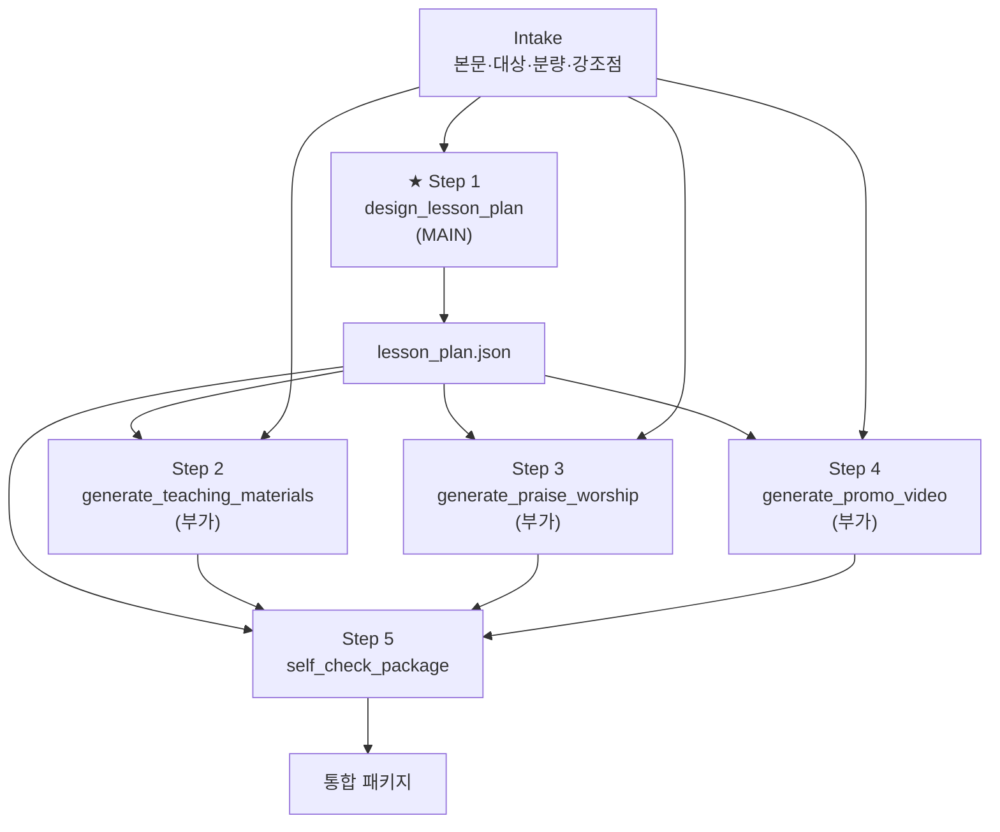

# Lesson Package Generator — Master Plan

> **Status**: PLAN v0.2 — skeleton code aligned (see §11)  
> **Module ID**: `lesson-package-generator`  
> **Skill name** (planned): `lesson-package`  
> **Document prefix** (planned): `LESSON-PACKAGE`  
> **Reference template**: `autobiography-generator/` + `AUTOBIOGRAPHY-*.md`

---

## 0. Executive Summary

**Lesson Package Generator** is a local-first workflow whose **primary product is an auto-designed lesson plan (수업안)**. Teaching aids, worship, and promo video are **supplementary artifacts** derived from that plan—not the core value proposition.

```
[입력: 본문 · 대상 · 분량 · 강조점]
    → (Research) 입력 정규화·분석
    → (Planning) 부가 산출물 포함 여부·일관성 규칙
    → (Implementation)
        ★ Step 1  수업안 설계 (MAIN)
              → 학습목표·도입·본문전개·핵심메시지·적용·토의질문·마무리·시간배분
        ○ Step 2  교보재 생성 (부가)  ← 수업안 입력
        ○ Step 3  찬양 생성 (부가)    ← 수업안 입력
        ○ Step 4  홍보영상 생성 (부가) ← 수업안 입력
        → Step 5  자기검수
    → [출력: 수업안 + 선택적 부가물 + 통합 패키지]
```

**Product hierarchy**

| Tier | Step | User-facing name | Required for MVP |
|------|------|------------------|------------------|
| **Core** | 1 | 수업안 자동 설계 | **Yes** — app succeeds if this alone is excellent |
| **Supplementary** | 2 | 교보재 (도입게임·토의·활동·워크시트) | Optional per run |
| **Supplementary** | 3 | 찬양 | Optional per run |
| **Supplementary** | 4 | 홍보영상 (제작 스펙) | Optional per run |
| **Integration** | 5 | 자기검수 | Yes when any supplementary step ran |

**Architectural invariant**: Each step is an **independent module** (one `run()` + one prompt). Step *N* consumes the frozen **intake snapshot** and, for steps 2–5, the canonical **`lesson_plan.json`** from Step 1. Supplementary modules must not re-interpret 본문 independently of the approved lesson plan.

**Quality posture**: Inherit AgenticWorkflow DNA (SOT, L0–L2, P1 scripts, English-first execution, Korean user-facing docs + `.ko` pairs where applicable). Parent reference: `AGENTICWORKFLOW-ARCHITECTURE-AND-PHILOSOPHY.md`, `AGENTS.md`, `soul.md`.

---

## 1. Product Definition

### 1.1 One-line value

> Enter **본문, 대상, 분량, 강조점** → get a **complete, time-boxed lesson plan (수업안)** ready to teach. Optionally generate **교보재 · 찬양 · 홍보영상** packages that stay aligned with that plan.

### 1.2 Main feature — Step 1: 수업안 설계

**Purpose**: Replace manual lesson planning with a structured, teachable flow grounded in the source text and audience.

| | |
|---|---|
| **Input** | `body_text` (본문), `audience` (대상), `volume` (분량), `emphasis` (강조점) |
| **Output** | Canonical `lesson_plan.json` + human-readable `lesson_plan.md` |

**Required output sections** (all must appear in Step 1 artifact):

| Section | Korean | Content expectation |
|---------|--------|---------------------|
| Learning objectives | 학습목표 | 2–5 measurable outcomes for this session |
| Introduction | 도입 | How to open; attention hook; link to prior knowledge |
| Body development | 본문전개 | Exposition aligned to `body_text`; movement/structure |
| Key message | 핵심메시지 | One memorable takeaway (1–3 sentences) |
| Application | 적용 | Life/practice bridge for `audience` |
| Discussion questions | 토의질문 | Ordered questions (individual → group) |
| Closing | 마무리 | Summary, prayer/reflection, next step as appropriate |
| Time allocation | 시간배분 | Per-section minutes; sum = `volume` |

**Success criterion**: A teacher can run the session using **only** Step 1 output, without opening supplementary files.

### 1.3 Intake contract (pipeline input)

| Field | Required | Description | Example |
|-------|----------|-------------|---------|
| `body_text` | Yes* | 본문 (성경 본문, 강의 원고, 요약) | 요 3:16 전문 또는 2단락 요약 |
| `audience` | Yes | 대상 (연령, 인원, 맥락) | "중고등부 25명, 금요 청년예배" |
| `volume` | Yes | 분량 — 총 진행 시간(분) 또는 회차 구조 | `90` (분) 또는 `"45분 × 2회"` |
| `emphasis` | Yes | 강조점 — 전달 우선순위, 금기, 특별 요청 | "은혜 강조, 공포·정죄 톤 지양" |
| `locale` | No | 출력 언어 우선순위 | `ko` (default) |
| `constraints` | No | 시설·인원·도구 제약 | "실외 불가, 피아노만" |

\* `body_text` OR file path in SOT after upload.

**Deprecated / moved**: `theme` is no longer a primary intake field; thematic focus belongs in **`emphasis`** or is derived into **핵심메시지** in Step 1. (Skeleton code may still accept `theme` until realignment.)

**Canonical intake artifact**: `outputs/intake/lesson_intake.json`

### 1.4 Supplementary outputs (부가 산출물)

All supplementary steps take **`lesson_plan.json` as primary input** (plus intake for constraints). They elaborate the plan; they do not replace it.

| Step | Name | Input | Output (planned) |
|------|------|-------|------------------|
| 2 | 교보재 | `lesson_plan` + intake | `outputs/teaching/` — 도입게임, 토의 활동지, 체험 활동, 워크시트 |
| 3 | 찬양 | `lesson_plan` + intake | `outputs/praise/` — 가사, 코드, 인도 노트 (핵심메시지·분위기 정합) |
| 4 | 홍보영상 | `lesson_plan` + intake | `outputs/promo/` — 스토리보드, 대본, CTA (수업/예배 홍보) |
| 5 | 자기검수 | intake + plan + any supplementary JSON | `outputs/package/lesson_package_manifest.json` |

**Orchestrator flags** (planned):

```yaml
run_supplementary:
  teaching: true   # step 2
  praise: false    # step 3
  promo: false     # step 4
```

Minimum viable run: **Step 1 only** → `status: completed` with `outputs.step-1` = lesson plan path.

### 1.5 Integrated package

| Artifact | Tier | Producer |
|----------|------|----------|
| `lesson_plan.json` / `.md` | **Core** | Step 1 |
| Teaching materials | Supplementary | Step 2 |
| Praise package | Supplementary | Step 3 |
| Promo spec | Supplementary | Step 4 |
| Manifest + self-check report | Integration | Step 5 |

### 1.6 Non-goals (MVP planning boundary)

- Cloud SaaS hosting or multi-tenant admin UI (local-first only).
- Video **rendering** in v1 — promo step outputs production spec only unless later approved.
- Supplementary steps running without a completed Step 1 (hard guard).
- Replacing human teacher judgment — `(human)` gates after Step 1 and before supplementary batch remain available.

---

## 2. Pipeline ↔ Parent 3-Phase Mapping

| Parent phase | Workflow steps (planned) | User-visible focus |
|--------------|------------------------|-------------------|
| **Research** | R1 Intake · R2 본문·맥띘 skim · R3 대상·분량 해석 | 입력 이해 |
| **Planning** | P1 부가 산출물 선택 · P2 수업안→부가 매핑 규칙 · P3 검증 체크리스트 | 실행 계획 |
| **Implementation** | **1 수업안 (MAIN)** · 2–4 부가 · 5 자기검수 | 생성 |

**Step numbering in `workflow.md` (proposed)**:

```
R1, R2, R3  →  P1, P2, P3  →  1 (수업안)  →  2, 3, 4 (부가, optional)  →  5 (검수)
```

**Human gates (proposed)**:

| After | Gate | Rationale |
|-------|------|-----------|
| R3 | `(human)` | Confirm intake + 분량·강조점 |
| **Step 1** | `(human)` | **Approve lesson plan before spending on 부가 산출물** |
| P1 (if skipping human after 1) | auto | Which supplementary modules to run |
| Step 5 | `(human)` | Final package (optional under Autopilot) |

---

## 3. Module Design — Independent Functions, Chained I/O

### 3.1 Module graph



### 3.2 Module contracts (logical)

#### `normalize_intake` (Research)

- **In**: raw user fields  
- **Out**: `lesson_intake.json`  
- **P1**: `validate_intake.py` — `body_text`, `audience`, `volume`, `emphasis` required  

#### ★ Module 1 — `design_lesson_plan` (MAIN)

- **In**: `lesson_intake.json`  
- **Out**: `outputs/lesson_plan/lesson_plan.json` + `lesson_plan.md`  
- **Must include**: 학습목표, 도입, 본문전개, 핵심메시지, 적용, 토의질문, 마무리, 시간배분  
- **Agent** (planned): `@lesson-plan-designer`  
- **P1** ✅ **implemented**: `validate_lesson_plan.py` — LP1–LP10 (sections present, time sum = volume ±5, ≥2 objectives, ≥3 discussion questions)  
- **Generation** ✅ **implemented**: `lesson_plan_generate.py` (Claude or deterministic placeholder) + `lesson_plan_contract.py` (`lesson-plan.v1` schema, validator, placeholder, markdown render)  

#### Module 2 — `generate_teaching_materials` (부가)

- **In**: `lesson_plan.json`, `lesson_intake.json`  
- **Out**: `teaching_materials.json` + `outputs/teaching/`  
- **Must include**: 도입게임, 토의, 활동, 워크시트 — each **mapped to** plan sections (도입/토의/적용 등)  
- **P1**: `validate_teaching_materials.py` — TM1–TM8 + cross-ref to plan section IDs  

#### Module 3 — `generate_praise_worship` (부가)

- **In**: `lesson_plan.json` (especially 핵심메시지, 분위기), intake  
- **Out**: `praise_package.json` + `outputs/praise/`  
- **P1**: `validate_praise_package.py` — PR1–PR6  

#### Module 4 — `generate_promo_video` (부가)

- **In**: `lesson_plan.json` (핵심메시지, 학습목표, 시간배분), intake  
- **Out**: `promo_video_spec.json` + `outputs/promo/`  
- **P1**: `validate_promo_spec.py` — PV1–PV7  

#### Module 5 — `self_check_package`

- **In**: intake + `lesson_plan.json` + any supplementary artifacts  
- **Out**: manifest, `self_check_report.md`  
- **Checks**: plan internally consistent; supplementary (if any) aligned to plan; time totals; no theological contradiction with `body_text`  
- **P1** ✅ **implemented**: `validate_package_integrity.py` — PK1–PK13 (deterministic) + `package_check.py` (check engine + report renderer)  
- **Implementation** ✅ deterministic self-check replaces the LLM stub; manifest `verdict` reflects real PK results  

### 3.3 Chaining rules (Orchestrator)

1. **Step 1 is mandatory** — no Step 2–4 without `lesson_plan.json` passing L0/L1.  
2. **Freeze intake** after R3; **freeze lesson plan** after Step 1 approval (human or Autopilot).  
3. **Supplementary skip** — if `run_supplementary.teaching: false`, skip Step 2; manifest records `skipped`.  
4. **Re-run** — Re-running Step 1 invalidates downstream supplementary versions (bump plan version, archive `_history/`).  
5. **SOT** stores paths + versions only.

---

## 4. Repository Layout (mirror `autobiography-generator`)

### 4.1 Root-level documents (3종 — planned)

| File | Role |
|------|------|
| `LESSON-PACKAGE-README.md` | **수업안 자동 설계** 중심 소개; 부가 산출물은 optional |
| `LESSON-PACKAGE-USER-MANUAL.md` | Intake → 수업안 검토 → 부가 선택 → 실행 |
| `LESSON-PACKAGE-ARCHITECTURE-AND-PHILOSOPHY.md` | Core vs supplementary tier, data flow |

### 4.2 Subproject tree (`lesson-package-generator/`)

```
lesson-package-generator/
├── PLAN.md
├── workflow.md
├── state.yaml
│
├── projects/{YYYYMMDD-slug}/outputs/
│   ├── intake/
│   ├── lesson_plan/          ← ★ MAIN artifact root
│   ├── teaching/             ← 부가
│   ├── praise/               ← 부가
│   ├── promo/                ← 부가
│   ├── package/
│   └── _history/
│
├── schemas/
│   ├── lesson_intake.schema.json
│   ├── lesson_plan.schema.json       ← NEW (core)
│   ├── teaching_materials.schema.json
│   ├── praise_package.schema.json
│   ├── promo_video_spec.schema.json
│   └── package_manifest.schema.json
│
├── scripts/
│   ├── orchestrator.py
│   ├── claude_client.py
│   ├── validate_intake.py
│   ├── validate_lesson_plan.py       ← NEW (core P1)
│   ├── validate_teaching_materials.py
│   ├── validate_praise_package.py
│   ├── validate_promo_spec.py
│   └── validate_package_integrity.py
│
├── agents/prompts/
│   ├── step1_lesson_plan.md          ← ★ MAIN prompt
│   ├── step2_teaching_materials.md   ← 부가
│   ├── step3_praise_worship.md
│   ├── step4_promo_video.md
│   └── step5_self_check.md
│
└── modules/ (under scripts/modules/)
    ├── step1_lesson_plan.py
    ├── step2_teaching.py
    ├── step3_praise.py
    ├── step4_promo.py
    └── step5_self_check.py
```

**Note**: Current skeleton uses legacy step order (teaching as step1). Realignment tracked in §11.

### 4.3 Skill & registration (unchanged intent)

- `.claude/skills/lesson-package/` — route: intake → **plan first** → optional supplementary  
- `detect_projects.py` — SOT `lesson-package-generator/state.yaml`  
- Triggers (proposed): **"수업안 설계"**, "수업안 자동", "lesson plan", "lesson package"

---

## 5. `workflow.md` Outline (Phase A)

1. Overview — **core = 수업안**, supplementary optional  
2. Inherited DNA  
3. Research R1–R3  
4. Planning P1–P3 (부가 선택)  
5. Implementation Step 1 (MAIN) — full Verification for eight sections  
6. Implementation Steps 2–4 (부가) — `Requires: lesson_plan`  
7. Step 5 self-check  
8. Agent registry, P1 scripts, output dirs  

### 5.1 Verification criteria (draft)

**Step 1 — 수업안 설계 (MAIN)**

- [ ] All eight sections present: 학습목표, 도입, 본문전개, 핵심메시지, 적용, 토의질문, 마무리, 시간배분  
- [ ] `시간배분` sums to `volume` (±5 min tolerance)  
- [ ] ≥3 토의질문; ≥2 학습목표  
- [ ] 본문전개 anchors to `body_text` (≥3 explicit references)  
- [ ] `emphasis` reflected in 핵심메시지 or 적용  
- [ ] Vocabulary appropriate for `audience`  

**Step 2 — 교보재 (부가)**

- [ ] 도입게임·토의·활동·워크시트 present  
- [ ] Each item cites `lesson_plan` section id or title  
- [ ] Activity times fit within plan `시간배분`  

**Step 3 — 찬양 (부가)**

- [ ] Aligns with plan `핵심메시지`  
- [ ] Leader notes reference plan `마무리` or `도입` slot  

**Step 4 — 홍보영상 (부가)**

- [ ] CTA and hook reflect plan `학습목표` / `핵심메시지`  

**Step 5 — 자기검수**

- [ ] Manifest lists `lesson_plan` as `core: true`  
- [ ] 0 Critical cross-plan contradictions  
- [ ] Skipped supplementary steps recorded explicitly  

---

## 6. `state.yaml` Outline (updated)

```yaml
meta:
  package_id: ""
  locale: ko

workflow:
  name: lesson-package
  current_step: 0
  status: not_started

intake:
  body_text_ref: ""
  audience: ""
  volume: ""              # 분량 (e.g. "90" or "45분×2")
  emphasis: ""
  frozen_at_step: null

run_supplementary:
  teaching: true
  praise: false
  promo: false

outputs:
  step-1: ""              # lesson_plan (CORE)
  step-2: ""              # teaching (optional)
  step-3: ""
  step-4: ""
  step-5: ""              # manifest
  package_bundle: ""

modules:
  lesson_plan:            # ★ renamed from implicit teaching-first
    version: 0
    artifact: ""
  teaching:
    version: 0
    artifact: ""
    skipped: false
  praise:
    version: 0
    artifact: ""
    skipped: true
  promo:
    version: 0
    artifact: ""
    skipped: true
  integration:
    version: 0
    manifest: ""
```

---

## 7. Documentation 3종 — Content Plan

### 7.1 README

- Lead with **수업안 자동 설계**  
- Diagram: intake → **수업안** → (optional 부가) → package  
- "부가 산출물 없이 수업안만 생성 가능"  

### 7.2 USER-MANUAL

- Workflow: fill 본문·대상·분량·강조점 → run Step 1 → **review plan** → tick 부가 options → continue  

### 7.3 ARCHITECTURE

- § Core vs supplementary tier  
- § Why lesson plan is the SOT for content (not `state.yaml` prose — structural SOT remains orchestrator file)  

---

## 8. Implementation Phases

| Phase | Deliverable |
|-------|-------------|
| **A — Spec** | ✅ This PLAN + `workflow.md` + `lesson_plan.schema.json` |
| **A′ — Realign skeleton** | ✅ Renumber steps; `step1_lesson_plan`; intake `volume`/`emphasis`; orchestrator flags |
| **A″ — Step 1 real generation** | ✅ `lesson_plan_contract.py` + `lesson_plan_generate.py` — Step 1 now emits a validated `lesson-plan.v1` (no more placeholder sections) |
| **B — Skill** | `.claude/skills/lesson-package/` (pending) |
| **C — P1** | ✅ `validate_lesson_plan.py` (LP1–LP10) · ✅ `validate_package_integrity.py` (PK1–PK13) · `validate_intake.py` + supplementary standalone validators (pending) |
| **D — Integration** | `detect_projects`, doc 3종 (pending) |

---

## 9. Open Decisions

| # | Question | Recommendation |
|---|----------|----------------|
| 1 | `volume` format | Minutes (int) + optional `volume_label` string for multi-session |
| 2 | Step 1 only as default run | **Yes** — supplementary off by default in CLI |
| 3 | `theme` field | Remove; use `emphasis` only |
| 4 | Translation | EN execution + `.ko.md` for lesson plan first |
| 5 | Skill triggers | **"수업안 설계"**, "수업안 자동", "lesson plan" |

---

## 10. Checklist — Module Addition Rules

- [x] Subproject `lesson-package-generator/`  
- [x] Doc 3종 `LESSON-PACKAGE-*.md` planned  
- [x] Core vs supplementary architecture documented  
- [x] Skeleton code realigned to Step 1 = lesson plan (§11)  
- [x] Step 1 produces a real, validated lesson plan (LP1–LP10) — not placeholder sections  
- [x] Step 5 runs a real deterministic self-check (PK1–PK13) — verdict no longer a hardcoded PASS  
- [x] Supplementary placeholder generators derive `key_message` from the plan (PK10 clean; 부가물이 수업안에서 파생)  
- [ ] `AGENTS.md` / `start.md` registration — Phase B  

---

## 11. Skeleton code (aligned with v0.2)

| Item | Location |
|------|----------|
| Orchestrator | `scripts/orchestrator.py` — gates + `run_supplementary` |
| Step 1 MAIN | `scripts/modules/step1_lesson_plan.py` → `lesson_plan_generate.py` + `lesson_plan_contract.py` (real `lesson-plan.v1`) |
| Step 1 P1 | `scripts/validate_lesson_plan.py` (LP1–LP10) |
| Step 5 self-check | `scripts/modules/step5_self_check.py` → `package_check.py` (deterministic PK1–PK13, real verdict) |
| Step 5 P1 | `scripts/validate_package_integrity.py` (PK1–PK13) |
| Steps 2–4 부가 | **외부 독립 모듈로 추출** — `material-generator` · `anthem-generator` · `promo-video-generator`. lesson-package는 `scripts/modules/step2_teaching·step3_praise·step4_promo` **shim**으로 호출(로직 중복 0). 상세: `MODULE-EXTRACTION-PLAN.md` |
| Step 5 | `step5_self_check.py` |
| Claude (single) | `scripts/claude_client.py` — `content-common` 재노출 shim |
| Options | `scripts/pipeline_options.py` |
| Outputs | `outputs/lesson_plan/` (core), `teaching/`, `praise/`, `promo/`, `package/` |

---

## 12. Next Actions

1. **Approve PLAN v0.2** — core = 수업안, 부가 = 2–4.  
2. **Realign skeleton** (Phase A′) or approve before coding.  
3. Author `workflow.md` + `lesson_plan.schema.json`.  
4. Write doc 3종 with 수업안-first messaging.

---

*Document version: 0.2 — 수업안 설계 as main feature; supplementary outputs repositioned*  
*Last updated: 2026-06-01*
